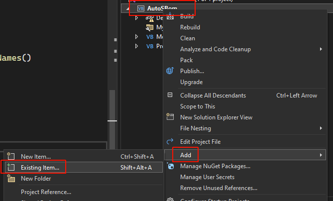
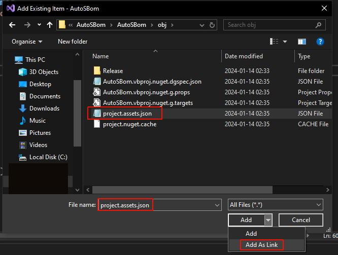
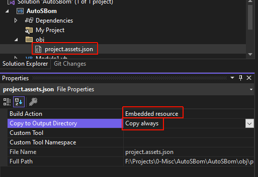

# AutoSBOM
A .NET auto SBOM Generator from Reflection.Assembly() + Embedded resource file (project.assets.json)

Basically these extract the Reflection.Assemblys + References from the resource file and outputs them into a CSV format, the advantage here is that you do not need any external tools to generate this information. Please note that there is no XML/JSON formatting, if you want that - add it yourself.

Your job is to import the "project.assets.json" file as an Embedded Resource into the project/solution (see below on how to do that). After that, you just call the function and it will spit out all the packages.

As an example, this is what you get:

VB .NET and C# versions available. Works with .NET5 and up, 4.8 and below are NOT supported.

CC0 so go nuts.

# Adding a reference to project.assets.json

Start by right-clicking the project, then add and existing item: 

Then navigate to the obj folder and select project.assets.json. Select "Add as Link" from options. 

Now, in the solution explorer, click on the referenced project.assets.json file, set to Embedded Resource and Always copy. 

NOTE: This has to be done for all projects in the solution, and you have to call the function from each project in the solution to get the results.
