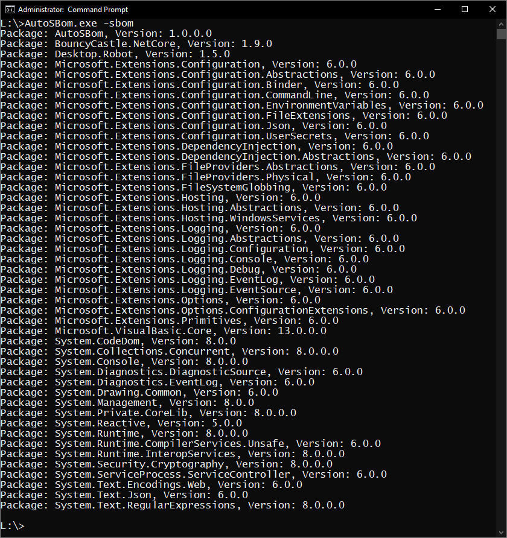

# AutoSBOM
Auto SBOM Generator from Reflection.Assembly() + Embedded resource file (project.assets.json)

Basically these extract the Reflection.Assemblys + References from the resource file and outputs them into a CSV format.
Please note that there is no XML/JSON formatting, if you want that - add it yourself.

Your job is to import the "project.assets.json" file as an Embedded Resource into the project/solution. After that, you just call the function and it will spit out all the packages.

This is what you get:

VB .NET and C# versions available. Works with .NET5 and up, 4.8 and below are NOT supported.

CC0 so go nuts.
